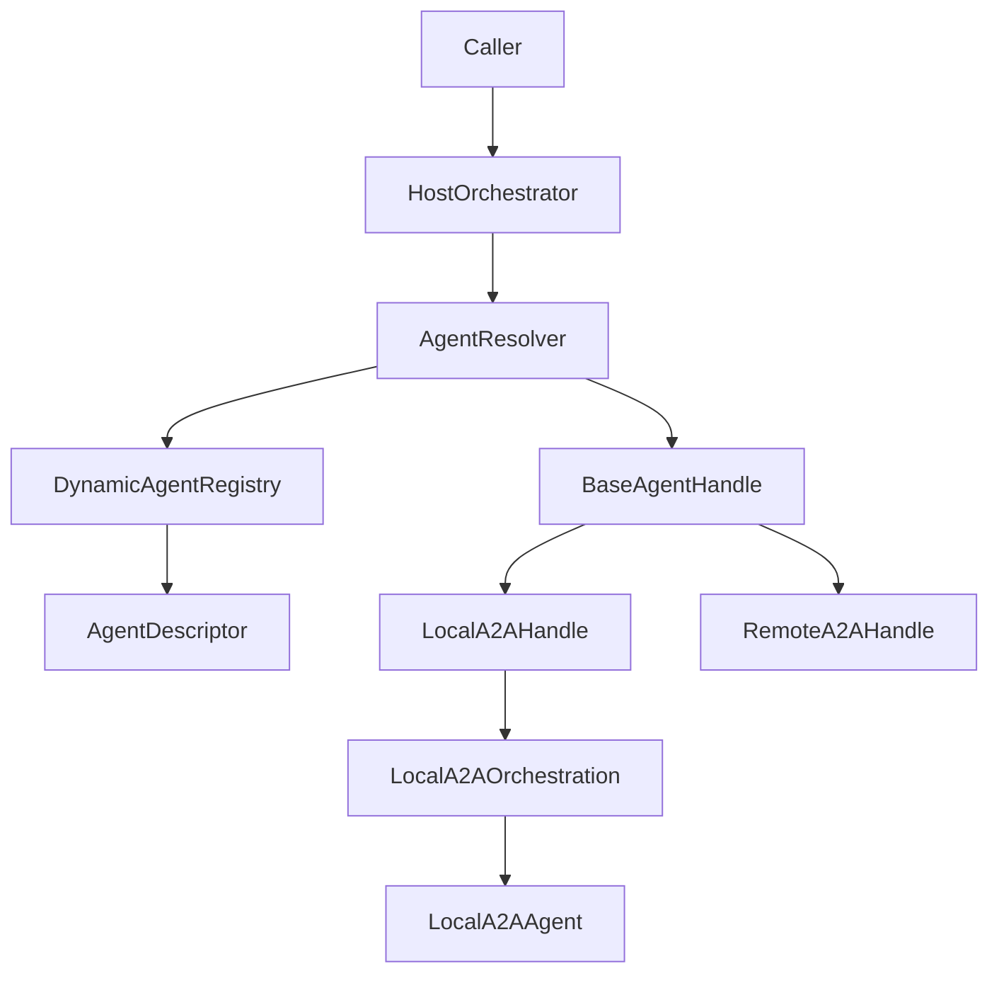

## Agent Core

This folder contains the shared runtime layer that sits above concrete agents such as `planning_agent`.

The purpose of `agent_core` is to let the rest of the system resolve and invoke agents by capability, without caring whether the selected agent is:

- a local in-process A2A agent built from Python
- a remote/network A2A agent hosted elsewhere
- another backend type added later

## Main idea

The core design separates five responsibilities:

1. **Descriptor**
   - what an agent is
   - what skills it exposes
   - how it can be reached

2. **Handle**
   - how an agent is invoked
   - local and remote backends share the same high-level interface

3. **Registry**
   - where descriptors are stored at runtime
   - supports dynamic registration and filtering

4. **Resolver**
   - how the best agent is selected for a skill/capability request

5. **Host Orchestrator**
   - how callers ask for a skill and get back a normalized invocation result

## File overview

### `agent_descriptor.py`

Defines normalized runtime models:

- `AgentDescriptor`
- `SkillDescriptor`
- `AgentBackendType`
- `AgentHealthStatus`

This is the data model for one resolvable agent endpoint.

Important fields in `AgentDescriptor`:

- `agent_id`
- `agent_name`
- `description`
- `skills`
- `tags`
- `backend_type`
- `endpoint`
- `local_builder`
- `cached_agent_card`
- `health_status`
- `available`
- `metadata`

Key point:

`AgentDescriptor` describes **how to resolve/use** an agent.  
It does **not** execute the agent itself.

### `agent_handle.py`

Defines the unified invocation interface:

- `BaseAgentHandle`
- `LocalA2AHandle`
- `RemoteA2AHandle`
- `AgentInvocationResult`

Shared handle methods:

- `get_agent_card(...)`
- `send_message(...)`
- `get_task(...)`
- `run(...)`

#### `LocalA2AHandle`

This wraps a local builder-backed A2A agent.

It:

- lazily builds the in-process A2A agent from `descriptor.local_builder`
- uses the local A2A helper functions from `a2a_orchestration.py`
- returns a normalized `AgentInvocationResult`

#### `RemoteA2AHandle`

This is currently a stub for future network A2A support.

Right now:

- `get_agent_card(...)` can return cached/basic metadata
- `send_message(...)` and `get_task(...)` raise `NotImplementedError`

This keeps the architecture ready for remote transport without forcing full HTTP implementation yet.

### `agent_registry.py`

Defines `DynamicAgentRegistry`.

Responsibilities:

- register local agents dynamically
- register remote agents dynamically
- store descriptors by `agent_id`
- filter descriptors by:
  - skill
  - tags
  - name
  - metadata
  - backend type
- resolve a descriptor into a cached handle

Important:

This is **not** a hardcoded module-level dict.  
It is an object you create at runtime and populate explicitly.

### `agent_resolver.py`

Defines `AgentResolver`.

Responsibilities:

- select candidates from the registry
- rank candidates
- prefer local over remote when configured
- return the best descriptor or handle

Current behavior:

- exact skill match is the main path
- tags/name/metadata can also be used
- single best match is returned

Future expansion:

- multi-agent fanout
- weighted ranking
- policy-based selection

### `host_orchestrator.py`

Defines `HostOrchestrator`.

This is the main entrypoint when a caller wants to say:

- “I need an agent that supports `plan_request`”

instead of:

- “Call this specific Python builder”

Responsibilities:

- accept capability request
- ask resolver for best match
- invoke through the unified handle
- return normalized response

## Local A2A support

### `a2a_orchestration.py`

This file contains reusable local A2A invocation helpers.

Core pieces:

- `OrchestrationMode`
  - `HOST_DRIVEN`
  - `AGENT_INTERNAL`
- `A2AFlowResult`
- local payload/request builders
- task id/status/text extraction helpers
- `run_local_a2a_orchestration(...)`

This is the implementation detail used by `LocalA2AHandle`.

It knows how to do the local in-process A2A flow:

1. optional `handle_authenticated_agent_card(...)`
2. `on_message_send(...)`
3. optional `on_get_task(...)`
4. normalize result

Important:

This file is about **local transport flow**, not capability routing.

## ADK-backed execution support

### `adk_a2a_execution_wrapper.py`

Defines `AdkA2aExecutionWrapper`.

This is a shared base class for agents that use:

- A2A task flow
- ADK `Runner`
- ADK in-memory session/memory/artifact services
- Langfuse chain tracing

Responsibilities:

- initialize `Runner`
- create/get session
- run the ADK agent
- extract final text event
- update A2A task status/artifacts
- wrap execution with Langfuse chain tracing

This is separate from registry/descriptor logic.

Think of it as:

- **execution runtime base**

while the other new files are:

- **discovery + routing + invocation abstraction**

## How the pieces fit together

## Planning agent example

The planning agent is the first concrete consumer of this core layer.

Planning-side integration:

- `planning_agent/agent_card.py`
  - source of metadata and skills
- `planning_agent/registry.py`
  - builds/registers planning descriptor
- `planning_agent/start_agent.py`
  - builds local A2A planning agent
- `planning_agent/a2a_executor.py`
  - thin execution wrapper
- `planning_agent/planning_adk_agent.py`
  - actual custom ADK agent
- `planning_agent/planning_agent.py`
  - planning engine/business logic

Flow:

1. create `DynamicAgentRegistry`
2. call `register_local_planning_agent(...)`
3. create `HostOrchestrator`
4. invoke by `skill_id="plan_request"`
5. resolver picks planning descriptor
6. `LocalA2AHandle` invokes the local planning A2A agent
7. normalized result is returned to caller

## Why this structure exists

Without this layer, callers must know too much:

- which Python builder to call
- which transport the agent uses
- how to build A2A request objects
- how to fetch task results

With this layer, callers only need:

- registry
- resolver/orchestrator
- requested capability

## Current limitations

- remote/network A2A handle is still a stub
- resolver selects one best match only
- no service discovery refresh loop yet
- no multi-agent fanout yet

## Intended future direction

This core is ready for:

- remote A2A HTTP transport
- richer health checks
- policy-based routing
- fanout/multi-candidate orchestration
- capability discovery from config or service registry

In short:

- `agent_core` is the shared capability-routing and invocation layer
- concrete agents stay in their own folders
- callers should depend on the orchestrator/handles, not on agent-specific builders
