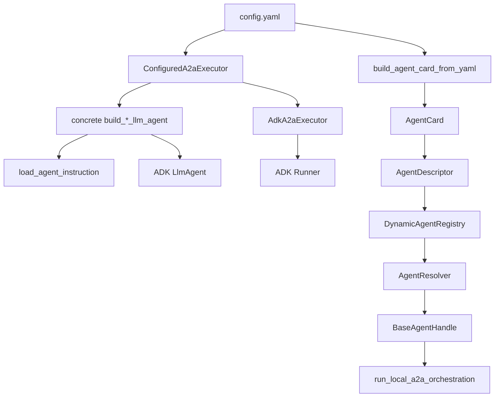

# Agent Core Map

This document maps the current `agents.agent_core` package so future refactors can move
related modules into clearer subfolders without losing the runtime story.

`agent_core` is the shared layer between concrete agents and the host application. It
normalizes agent metadata, builds local A2A agents, wraps ADK execution, routes by
capability, and adapts ADK model calls to `llm_inference_core`.

## Runtime Flow

The package has two related flows: agent construction and agent invocation.



The construction path starts with YAML and concrete agent builders. The invocation path
starts with descriptors in a registry and ends with a normalized `AgentInvocationResult`.

## Module Categories

### A2A Transport And Cards

These files know about A2A request/card shapes and local in-process A2A execution.

- `a2a/agent_card_yaml.py`
  Builds an A2A `AgentCard` from YAML. It reads `card_config`, validates agent name and
  skills, converts each skill into `AgentSkill`, then calls Vertex's `create_agent_card`.

- `a2a/agent_builder.py`
  Builds a local Vertex `A2aAgent` from an agent card and executor import path. This is
  the bridge from package metadata to an in-process A2A runtime object.

- `a2a/local_orchestration.py`
  Implements the local A2A card/send/task flow. It builds HTTP-shaped Starlette
  requests, sends messages to the local A2A agent, optionally fetches task state, extracts
  task ids/status/text, and returns `A2AFlowResult`.

This group is transport-specific. It should not own capability routing, prompt loading,
or model/provider behavior.

### ADK Execution

`adk/executor.py` adapts an A2A task into ADK agent execution. It contains:

- `AdkA2aExecutor`, the base `AgentExecutor` implementation for A2A agents backed by
  ADK. It creates an ADK `Runner`, manages in-memory session/memory/artifact services,
  runs the ADK agent, extracts final text, updates A2A task state, and wraps execution
  in Langfuse tracing.
- `ConfiguredA2aExecutor`, the YAML-driven subclass. It loads `executor_config`, imports
  the configured ADK agent builder, passes supported config values such as
  `instruction_prompt_name`, `instruction_prompt_label`, and `fallback_instruction`, and
  exposes executor-level names like `trace_name`, `artifact_name`, and
  `failed_text_message`.

This group is runtime glue for ADK. It should stay separate from agent discovery and
registry concerns.

### Agent Catalog And Routing

These files describe available agents and choose which one should handle a request.

- `routing/descriptor.py`
  Defines `AgentDescriptor`, `SkillDescriptor`, `AgentBackendType`, and
  `AgentHealthStatus`. It also normalizes A2A card skills into runtime descriptors and
  builds local descriptors from agent cards.

- `routing/registry.py`
  Runtime registry for local and remote descriptors. It supports registering descriptors,
  filtering by skill/tags/name/metadata/backend, and caching handles per `agent_id`.

- `routing/resolver.py`
  Selects ordered candidates from the registry. Current ranking prefers local backends
  when configured, then healthier descriptors, then stable name ordering.

- `routing/handle.py`
  Defines the common invocation surface: `BaseAgentHandle`, `LocalA2AHandle`,
  `RemoteA2AHandle`, and `AgentInvocationResult`. Local handles call
  `run_local_a2a_orchestration`; remote handles are placeholders for future network A2A.

- `routing/orchestrator.py`
  High-level entrypoint for callers that want to invoke by capability instead of by a
  concrete Python builder. It resolves a handle and returns a normalized invocation
  result.

This group is the "agent catalog" layer. It should not know how to build prompt
providers or how ADK translates model requests.

### Inference And Prompts

These files connect ADK to `llm_inference_core`.

- `inference/settings.py`
  Builds `InferenceCoreSettings` from environment variables plus overrides. It owns the
  legacy flat override mapping and creates `InferenceProvider` instances with a
  `ProjectContext`.

- `inference/llm_adapter.py`
  Implements an ADK `BaseLlm` backed by `llm_inference_core.providers.InferenceProvider`.
  It converts ADK `LlmRequest` values into provider payloads, exports ADK tool
  declarations as OpenAI-style tools, forwards trace ids, and converts provider
  `tool_calls` back into ADK `FunctionCall` parts.

- `inference/prompt.py`
  Loads agent instructions through `make_prompt_provider`. It resolves a default prompt
  name like `agents/{agent_name}/instruction`, applies an optional label, and falls back
  to config-provided instruction text when prompt lookup fails or returns empty text.

This group is provider-facing. It should remain independent from A2A card loading and
registry selection.

### Package Surface

- `__init__.py`
  Re-exports the current public surface for `agents.agent_core`. Any refactor should
  decide whether this file remains a compatibility layer for old imports.

## Config-Driven Agent Wiring

A config-driven agent currently uses one YAML file for two concerns:

- `card_config` describes the public A2A card: agent name, description, skills, tags, and
  examples.
- `executor_config` describes runtime wiring: ADK agent builder import path, prompt name,
  prompt label, fallback instruction, trace name, artifact name, and failure text.

For the Zep agent, the flow is:

1. `registry.py` calls `build_agent_card_from_yaml(config_path, config_section="card_config")`.
2. The registry or local builder wraps that card in an `AgentDescriptor`.
3. A local A2A agent is built with `ConfiguredA2aExecutor(config_path=..., config_section="executor_config")`.
4. `ConfiguredA2aExecutor` imports `agents.zep_agent.a2a_agent_core.build_zep_llm_agent`.
5. It passes prompt-related config into the builder when the builder signature supports it.
6. The concrete builder calls `load_agent_instruction`.
7. The returned instruction string is passed into `LlmAgent(instruction=...)`.

The prompt provider is the primary source of instructions when it can resolve the prompt
name and label. `fallback_instruction` from YAML is the local backup.

## Refactor Candidate Layout

The current flat package is workable, but the responsibilities are now distinct enough
for subfolders.

Proposed layout:

```text
agents/agent_core/
  __init__.py
  a2a/
    agent_builder.py
    agent_card_yaml.py
    local_orchestration.py
  adk/
    executor.py
  routing/
    descriptor.py
    handle.py
    registry.py
    resolver.py
    orchestrator.py
  inference/
    settings.py
    llm_adapter.py
    prompt.py
```

## Rename Candidates

These are remaining name candidates for a later refactor, not changes to make automatically.

- `ConfiguredA2aExecutor` -> `YamlA2aExecutor` or `ConfigFileA2aExecutor`
  The class is specifically YAML/config-file driven; "configured" is broad.

- `DynamicAgentRegistry` -> `RuntimeAgentRegistry`
  The registry is mutable at runtime; "dynamic" is less precise.

- `HostOrchestrator` -> `CapabilityOrchestrator`
  The class resolves by requested capability. "Host" says where it is used, not what it
  coordinates.

- `inference/settings.py` -> `settings.py` or `provider_factory.py`
  The file mainly builds settings and provider instances.

## Refactor Risks

- Import compatibility matters. Existing concrete agents should import from the grouped
  paths such as `agents.agent_core.adk.executor` and `agents.agent_core.inference.prompt`.
- `agents.agent_core.__init__` may need to remain a stable facade during migration.
- Tests should move with modules or keep compatibility import tests.
- YAML builder paths such as `adk_agent_builder` reference concrete agent modules; those
  should not change unless the concrete agent files move.
- `RemoteA2AHandle` is still a stub. Moving routing modules should not imply remote
  transport is implemented.
- `HostOrchestrator.invoke` currently passes `metadata` to `handle.run`, but not to
  `AgentResolver.resolve_handle`; if metadata routing is desired later, that behavior
  should be addressed separately from folder renames.

## Suggested Migration Order

1. Keep concrete agents importing from the grouped paths.
2. Update `agents.agent_core.__init__` only as the stable public facade.
3. Run focused tests for agent card loading, executor config, registry/resolver, local
   A2A orchestration, and inference adapter behavior after each structural change.
4. Avoid reintroducing flat module files at `agents/agent_core/*.py` for category-specific code.
