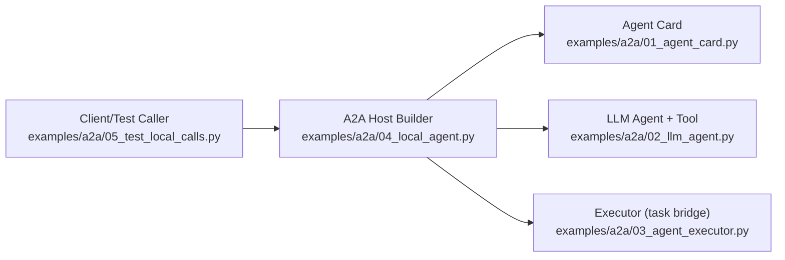
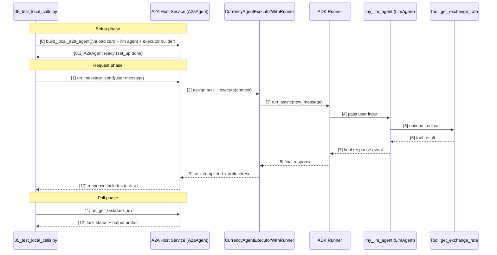

# A2A Request/Task Flow

## File Hierarchy (who is which)

```mermaid
flowchart LR
    A["Client/Test Caller<br/>examples/a2a/05_test_local_calls.py"]
    B["A2A Host Builder<br/>examples/a2a/04_local_agent.py"]
    C["Agent Card<br/>examples/a2a/01_agent_card.py"]
    D["LLM Agent + Tool<br/>examples/a2a/02_llm_agent.py"]
    E["Executor (task bridge)<br/>examples/a2a/03_agent_executor.py"]

    A --> B
    B --> C
    B --> D
    B --> E
```

## Runtime Sequence

```mermaid
sequenceDiagram
    participant T as 05_test_local_calls.py
    participant H as A2A Host Service (A2aAgent)
    participant X as CurrencyAgentExecutorWithRunner
    participant R as ADK Runner
    participant L as my_llm_agent (LlmAgent)
    participant U as Tool: get_exchange_rate

    Note over T,H: Setup phase
    T->>H: [0] build_local_a2a_agent()\n(load card + llm agent + executor builder)
    H-->>T: [0.1] A2aAgent ready (set_up done)

    Note over T,H: Request phase
    T->>H: [1] on_message_send(user message)
    H->>X: [2] assign task + execute(context)
    X->>R: [3] run_async(new_message)
    R->>L: [4] pass user input
    L->>U: [5] optional tool call
    U-->>L: [6] tool result
    L-->>R: [7] final response event
    R-->>X: [8] final response
    X-->>H: [9] task completed + artifact/result
    H-->>T: [10] response includes task_id

    Note over T,H: Poll phase
    T->>H: [11] on_get_task(task_id)
    H-->>T: [12] task status + output artifact
```
